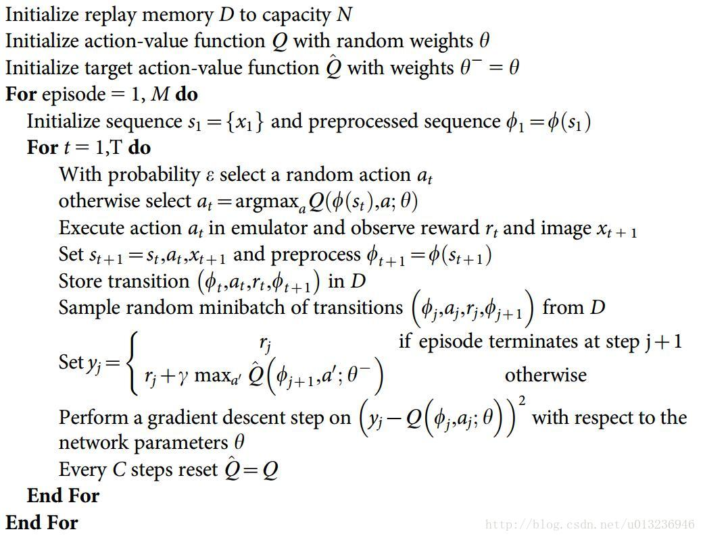
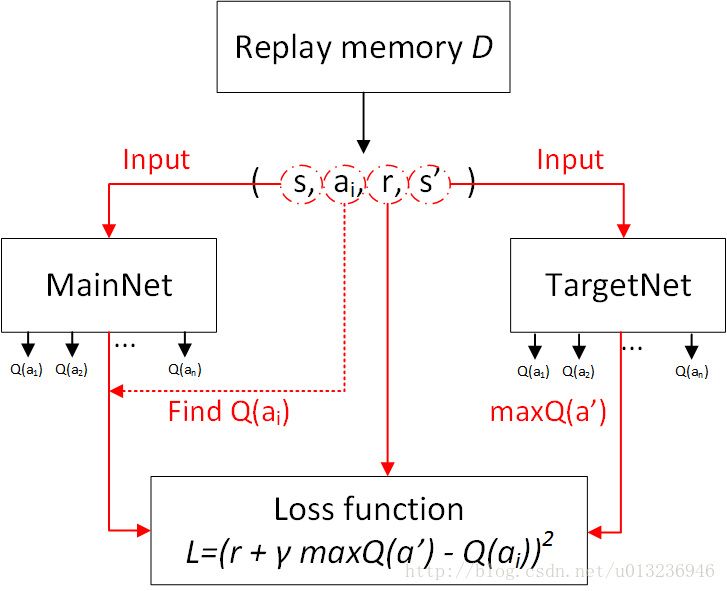

# Play CartPole through DQN

Tensorflow implementation of [Human-Level Control through Deep Reinforcement Learning]

This implementation contains:

1. Deep Q-network
2. Experience replay memory
    - to reduce the correlations between consecutive updates
3. Network for Q-learning targets are fixed for intervals
    - to reduce the correlations between target and predicted Q-values
## Algorithm:

## target network update model:

## Requirements

- Python 3
- [gym](https://github.com/openai/gym)
- [TensorFlow 1.8.0](https://github.com/tensorflow/tensorflow)
- [Tensorlayer 1.8.5](https://github.com/tensorlayer/tensorlayer)

## Usage

First, install prerequisites with:

    $ pip install gym
    $ pip install tensorlayer

To train a model:

    $ python main.py

if you want to see the display, modify the code main.py 

    display = True

To see the train log in tensorboard:

    $ tensorboard --logdir=./result/tensorboard

## References
- [Playing Atari with Deep Reinforcement Learning](https://arxiv.org/abs/1312.5602)
- [Human-level control through deep reinforcement learning](https://storage.googleapis.com/deepmind-media/dqn/DQNNaturePaper.pdf)

## License
GPLv3
